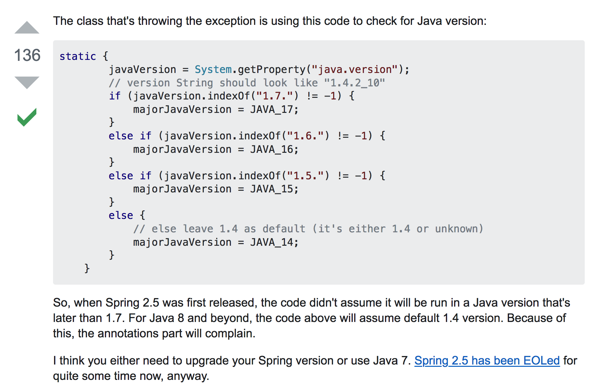

spring.version:2.5.6 + cxf.version:2.4.2  

需注意: 
0. cxf.version:2.4.2跟spring4.X有冲突,spring3.X我没尝试,刚好工作需要Spring2.X就直接试了spring2.X
1. spring2.5.X不能在1.8及以上的版本中运行,解释见https://stackoverflow.com/questions/23813369/spring-java-error-namespace-element-annotation-config-on-jdk-1-5-and-high


2. cxf.version2.X 需要再spring-context.xml中引入这仨哥们(cxf3.x中不需要):

```
<import resource="classpath:META-INF/cxf/cxf.xml"/>
<import resource="classpath:META-INF/cxf/cxf-extension-xml.xml"/>
<import resource="classpath:META-INF/cxf/cxf-servlet.xml"/>
```
